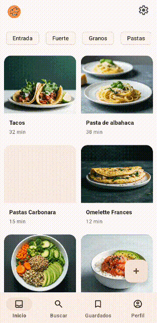
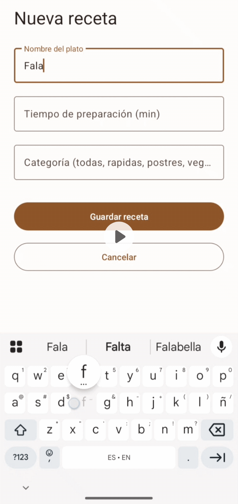

# Entregable - Uso del patrón MVVM y StateFlow dentro del proyecto

> Para esta sección, se contextualiza que el único flujo en nuestro programa que hasta el momento tiene los requerimientos solicitados en esta actividad es el de [AddRecipe.kt](https://github.com/AntJZs/Recipify/blob/main/app/src/main/java/com/progweb/recipify/addRecipe/AddRecipe.kt) , por lo tanto, se va a aplicar este ejemplo a los archivos de nuestro proyecto [RegisterViewModel.kt](https://github.com/AntJZs/Recipify/blob/main/app/src/main/java/com/progweb/recipify/viewmodel/AddRecipeViewModel.kt) y [AddRecipe.kt](https://github.com/AntJZs/Recipify/blob/main/app/src/main/java/com/progweb/recipify/addRecipe/AddRecipe.kt)    

## Capturas de pantalla



    
## ¿Dónde vive el estado?
En `_uiState = MutableStateFlow(UiState())` dentro del ViewModel. El Fragment/Activity no tiene ninguna variable de estado propia.

## ¿Qué pasa si se rota la pantalla?
```kotlin
lifecycleScope.launch {
    repeatOnLifecycle(Lifecycle.State.STARTED) {
        viewModel.uiState.collect { ... }
    }
}
```    
`repeatOnLifecycle` cancela el collector cuando la Activity va a background y lo reanuda cuando vuelve. El ViewModel sobrevive la rotación con el estado intacto.    

##  ¿Qué pasa si presiona Guardar dos veces?
```kotlin
fun saveRecipe(...) {
    if (_uiState.value.guardando) return  // segunda llamada ignorada
    _uiState.value = UiState(guardando = true)
    ...
}
```    

```kotlin
binding.btnGuardar.isEnabled = !estado.guardando  // botón deshabilitado visualmente.
```

## Primera Decisión

Incialmente implementamos Observer con LiveData pero dado el ejercicio, la necesidad del manejo de un código más limpio, evitar valores nulos y un mejor manejo de estados decidimos migrar a StateFlow con repeatOnLifecycle(Lifecycle.State.STARTED), esto ayudó a controlar mejor el envío de información evitando el gasto de recursos cuando la app se encuentra en segundo plano pero retomando su funcionamiento cuando nos encontramos dentro de ella, esto traduce en mayor rendimiento y control sobre los datos y mayor flexibilidad en el manejo de esto

## Segunda Decisión
Al desarrollar el código tuvimos que separar los estados de forma que cada uno fuera un LiveData, pero al incorporar un Un único UiState como data class con todos los campos, expuesto como StateFlow evitamos problemas de sincronización pues si el ViewModel emite dos cambios seguidos (primero limpia errores, luego marca success), la UI puede recibir dos eventos separados y parpadear. Con un único UiState, cada vez que el ViewModel emite, la UI recibe el estado completo y consistente de una sola vez. 
Además tenemos mayor facilidad para agregar campos nuevos (Estados) sin tocar la interfaz pública del ViewModel.

## Tercera Decisión

Primeramente no pensamos en ¿qué pasaría si el usuario diera doble click al botón de guardar? entonces nos dimos cuenta que es un caso bastante común, más aún si la respuesta de la plataforma es lenta o el flujo se ve interrumpido por esto decidimos agregar: 
```kotlin
guardando: Boolean
```
Al UiState y deshabilitar btnGuardar cuando es true, evitando duplicados de las recetas en nuestra base de datos. 
El campo "guardando" en el UiState actúa como semáforo — el ViewModel lo activa al inicio de la operación y lo desactiva al terminar. La Activity observa ese campo y deshabilita el botón en consecuencia, sin necesidad de lógica extra en la UI. 

## Cuarta Decisión


Actualmente el registro se guarda durante el tiempo de ejecución de la app debido a que al momento de desarrollar dimos foco al guardado de recetas no tanto al de los usuarios, por lo que por ahora, el usuario se registra y se guarda en un objeto tipo data class:

```kotlin
data class Usuario(
        val usuario: String,
        val nombre: String,
        val apellido: String,
        val password: String
    )
```

El usuario no puede guardarse si ya se encuentra registrado por las validaciones:    

```kotlin
fun register(usuario: String, nombre: String, apellido: String, password: String, confPassword: String) {
        var hasError = false
        var errorUsuario: String? = null
        var errorNombre: String? = null
        var errorApellido: String? = null
        var errorPassword: String? = null
        var errorConfPassword: String? = null

        if (usuario.isEmpty()) {
            errorUsuario = "Ingresa un usuario"
            hasError = true
        } else if (UsuariosManager.usuarios.containsKey(usuario)) {
            errorUsuario = "El usuario ya existe"
            hasError = true
        }

        if (nombre.isEmpty()) {
            errorNombre = "Ingresa tu nombre"
            hasError = true
        }

        if (apellido.isEmpty()) {
            errorApellido = "Ingresa tu apellido"
            hasError = true
        }

        if (password.isEmpty()) {
            errorPassword = "Ingresa una contraseña"
            hasError = true
        } else if (password.length < 6) {
            errorPassword = "Mínimo 6 caracteres"
            hasError = true
        }

        if (confPassword.isEmpty()) {
            errorConfPassword = "Confirma la contraseña"
            hasError = true
        } else if (password != confPassword) {
            errorConfPassword = "Las contraseñas no coinciden"
            hasError = true
        }

        if (hasError) {
            _registerState.value = RegisterResult(
                errorUsuario = errorUsuario,
                errorNombre = errorNombre,
                errorApellido = errorApellido,
                errorPassword = errorPassword,
                errorConfPassword = errorConfPassword
            )
        } else {
            val nuevoUsuario = UsuariosManager.Usuario(usuario, nombre, apellido, password)
            UsuariosManager.usuarios[usuario] = nuevoUsuario
            _registerState.value = RegisterResult(success = true, usuario = usuario)
        }
    }
```
Si el nuevo registro comparte nombre de usuario, nombre, apellido, hay campos vacíos o contraseñas con longitud menor a 6 el registro no se realizará hasta que estos hayan cambiado.


Y se maneja StateFlow en:

```kotlin
private val _registerState = MutableStateFlow(RegisterResult())
    val registerState: StateFlow<RegisterResult> = _registerState
```
Evitando así los problemas que trae consigo la implementación de LiveData.
