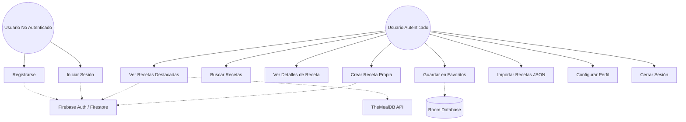

# D01. Diagrama de casos de uso

**Objetivo:** Mostrar los actores del sistema y las funcionalidades principales que ofrece la aplicación Recipify.

## Diagrama de Casos de Uso

## Explicación
- **Actores:** El usuario se divide en dos estados (No Autenticado y Autenticado). Los servicios de Firebase y la API externa actúan como actores de soporte.
- **Funcionalidades:** El flujo principal permite al usuario autenticado interactuar con recetas (ver, buscar, guardar y crear) y gestionar su perfil. La persistencia se divide entre Firebase (nube) y Room (local para favoritos).
