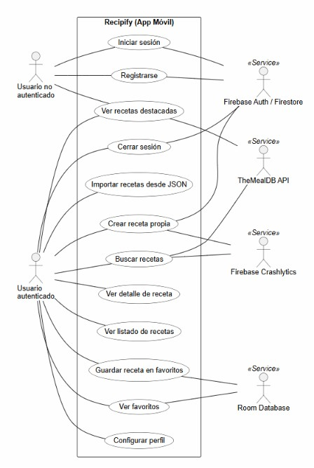
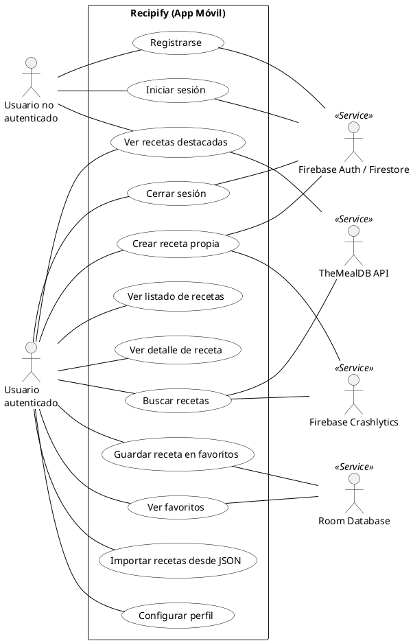

# D01. Diagrama de casos de uso

**Objetivo:** Representar de forma gráfica y estandarizada las interacciones entre los diferentes tipos de usuarios y las funcionalidades principales que ofrece el sistema Recipify, siguiendo el estándar clásico de diagramas UML de casos de uso (Actores Humanos -> Límite del Sistema -> Sistemas Externos).

## Visualización del Diagrama

## Especificación en PlantUML

## Descripción de Actores y Casos de Uso

### Actores
*   **Usuario no autenticado (Izquierda):** Representa al usuario que interactúa con la aplicación de forma anónima.
*   **Usuario autenticado (Izquierda):** Usuario con sesión activa y control sobre su recetario personal.
*   **Sistemas Externos (Derecha):**
    *   **Firebase:** Gestiona la identidad, base de datos en nube y almacenamiento.
    *   **TheMealDB:** API externa de recetas.
    *   **Room:** Persistencia local para modo offline.
    *   **Crashlytics:** Reporte de fallos.

> **Nota:** Para ver la imagen, asegúrate de que el archivo **Casosdeuso.jpg** esté dentro de la carpeta `docs/diagramas/`.
