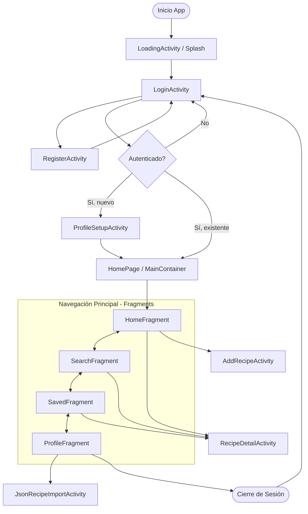

# D02. Diagrama de navegación o flujo de pantallas

**Objetivo:** Mostrar el flujo de navegación del usuario a través de las diferentes pantallas y fragmentos de la aplicación Recipify.

## Diagrama de Navegación

## Explicación
- **Entrada:** La aplicación inicia con una pantalla de carga (`LoadingActivity`) que verifica el estado de la sesión.
- **Flujo de Acceso:** El usuario puede registrarse o iniciar sesión. Si es un usuario nuevo, se le dirige a la configuración de perfil.
- **Navegación Central:** La `HomePage` actúa como contenedor para cuatro fragmentos principales accesibles mediante el menú inferior.
- **Acciones Secundarias:** Desde los fragmentos se puede acceder al detalle de una receta, al formulario de creación o a la herramienta de importación JSON.
