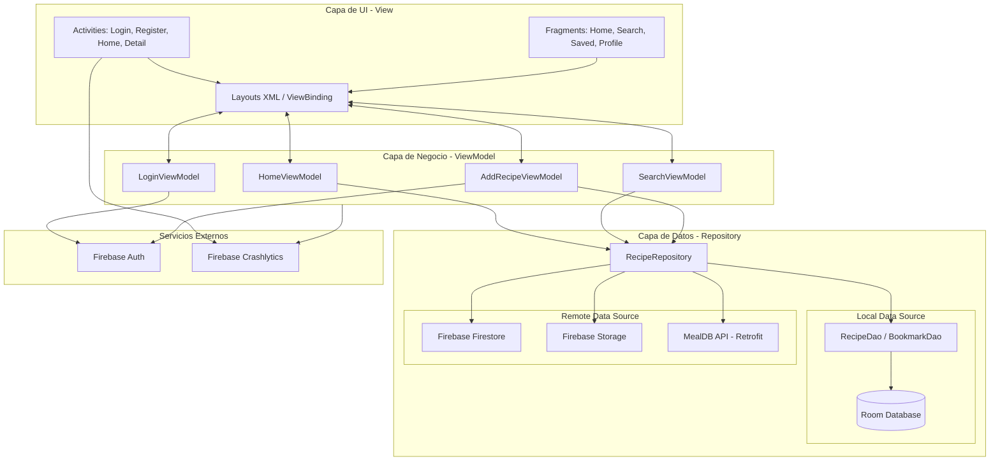

# D03. Diagrama de arquitectura móvil

**Objetivo:** Explicar la organización técnica de la aplicación Recipify, detallando la interacción entre las capas de UI, Lógica de Negocio y Datos siguiendo el patrón MVVM.

## Diagrama de Arquitectura

## Explicación
- **Capa de UI:** Compuesta por Activities y Fragments que utilizan ViewBinding para interactuar con los layouts XML.
- **Capa de ViewModel:** Encargada de gestionar el estado de la UI y comunicarse con el Repositorio. Utiliza Corrutinas y Flow para el manejo asíncrono.
- **Capa de Datos (Repository):** El `RecipeRepository` actúa como mediador entre la fuente de datos local (Room) y las fuentes remotas (Firebase y API externa).
- **Servicios Externos:** Firebase Auth gestiona la seguridad y Crashlytics se encarga de la observabilidad y reporte de errores.
