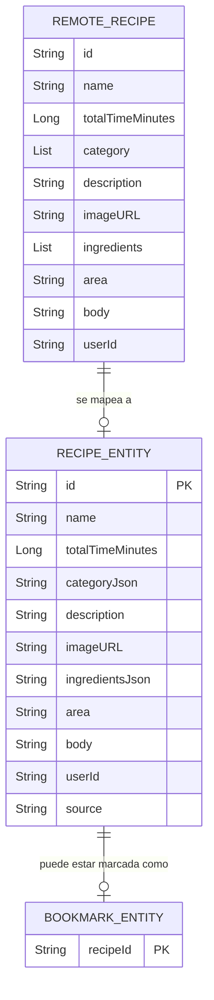

# D04. Diagrama de modelo de datos local y remoto

**Objetivo:** Mostrar la estructura de los datos utilizados en Recipify, tanto en la persistencia local (Room) como en la persistencia remota (Firestore/API).

## Diagrama de Modelo de Datos (ER)

## Explicación
- **Persistencia Local (Room):** 
    - `RECIPE_ENTITY`: Almacena la información de las recetas en una tabla SQLite. Los campos complejos (listas) se guardan como cadenas JSON para simplicidad.
    - `BOOKMARK_ENTITY`: Una tabla ligera que almacena los IDs de las recetas marcadas como favoritas para permitir el acceso rápido offline.
- **Persistencia Remota (Firestore / API):**
    - `REMOTE_RECIPE`: Representa el modelo de datos `Recipe` utilizado para la sincronización con Firestore y el consumo de *TheMealDB API*.
- **Relación:** Una receta local puede o no tener un marcador asociado. Los datos remotos se transforman a entidades locales cuando se requiere persistencia offline (favoritos).
