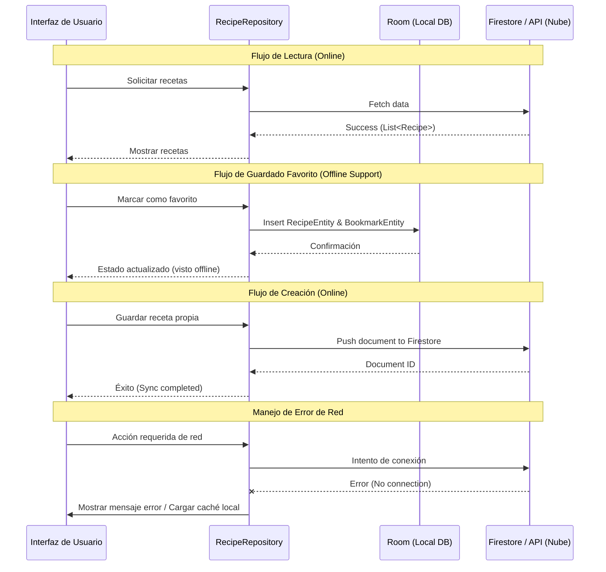

# D05. Diagrama de sincronización local-remoto

**Objetivo:** Explicar el flujo de datos entre la persistencia local (Room) y la nube (Firebase/API) en Recipify.

## Diagrama de Sincronización

## Explicación
- **Lectura:** Cuando hay conexión, la app prioriza los datos frescos de la API externa y Firestore.
- **Favoritos:** El guardado de favoritos se realiza principalmente de forma local en **Room**, lo que permite que el usuario consulte sus recetas guardadas incluso sin internet.
- **Escritura:** La creación de recetas propias se envía directamente a **Firestore**. Si no hay conexión, el sistema informa al usuario (Sincronización manual o reintento automático marcado como *Recomendado*).
- **Resiliencia:** Ante errores de red, la aplicación está diseñada para no cerrarse y ofrecer una alternativa basada en los datos persistidos localmente.
