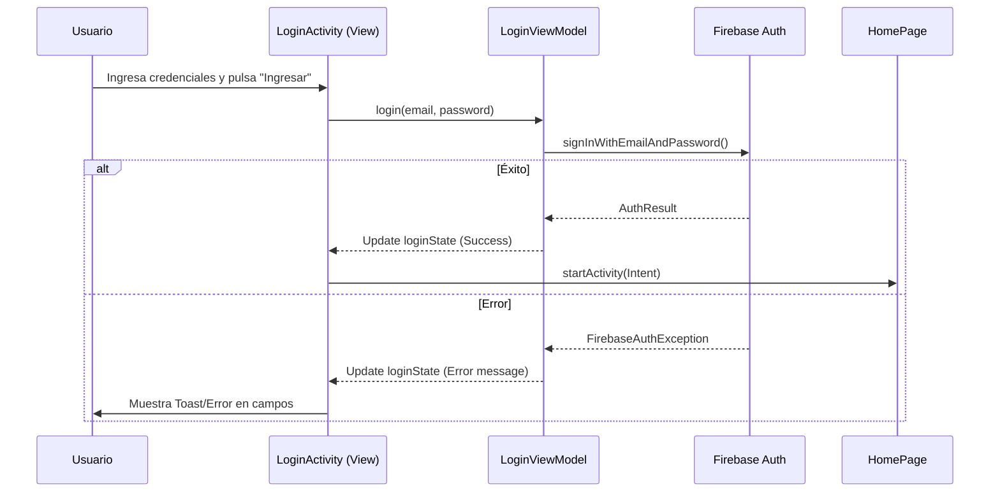
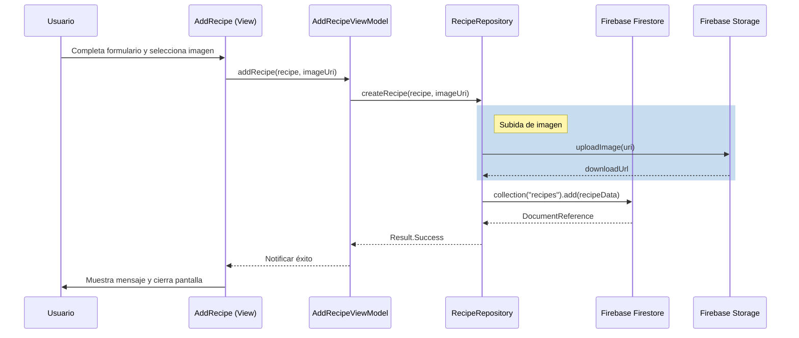
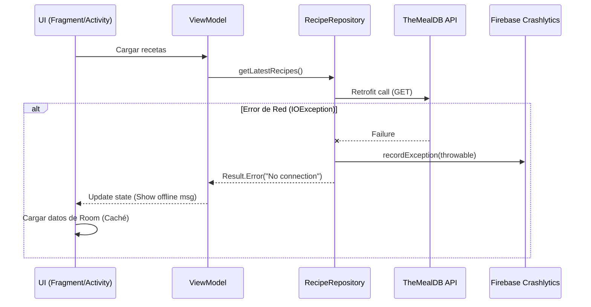

# D06. Diagramas de secuencia

**Objetivo:** Mostrar la interacción dinámica entre el usuario, la interfaz, los ViewModels y los servicios externos para flujos críticos de la aplicación.

## 1. Inicio de Sesión (Login)

## 2. Crear Receta Propia

## 3. Manejo de Error de Red y Crashlytics

## Explicación
- **Login:** Representa la validación de credenciales contra Firebase Auth y la transición a la pantalla principal.
- **Creación de Receta:** Detalla el flujo complejo que incluye la subida de una imagen a Storage y la persistencia del documento en Firestore.
- **Manejo de Errores:** Ilustra cómo la aplicación captura fallos de red, los reporta a Crashlytics para monitoreo y ofrece una alternativa al usuario basada en datos locales.
