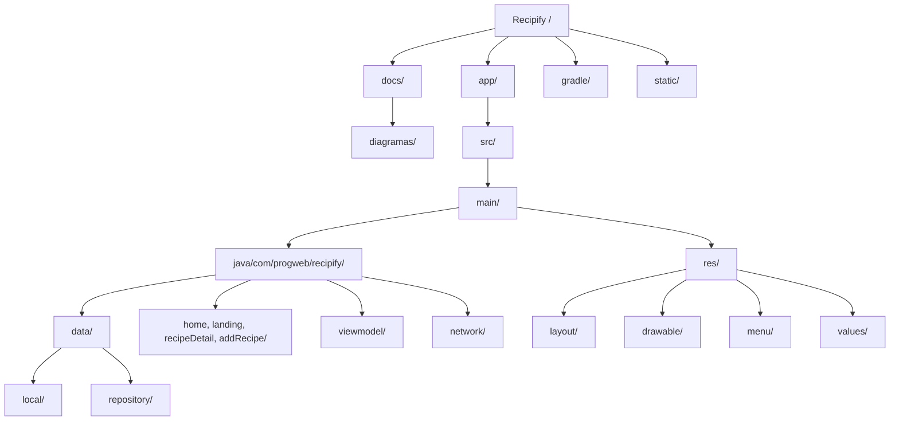

# D07. Diagrama de estructura de carpetas

**Objetivo:** Justificar la organización del repositorio y describir la responsabilidad de cada carpeta principal dentro del proyecto Recipify.

## Estructura del Proyecto

## Responsabilidades Principales

- **docs/**: Contiene toda la documentación técnica del proyecto (SRS, Arquitectura, Uso de IA) y esta carpeta de diagramas.
- **app/**: Módulo principal de la aplicación Android.
    - **src/main/java/...**: Código fuente en Kotlin organizado por capas y funcionalidades.
        - **data/**: Contiene la persistencia local (Room) y los repositorios.
        - **viewmodel/**: Lógica de estado y comunicación con la UI.
        - **network/**: Configuración de Retrofit y servicios de API externa.
        - **ui (varios paquetes)**: Activities y Fragments organizados por flujo (Landing, Home, Detail).
    - **src/main/res/**: Recursos visuales, layouts XML, menús y archivos de valores (strings, colors, themes).
- **gradle/**: Archivos de configuración del sistema de construcción Gradle.
- **static/**: Almacena recursos multimedia (GIFs, imágenes) utilizados exclusivamente para la documentación en el README.
- **build.gradle.kts (Raíz y App)**: Definición de dependencias, plugins y versiones del proyecto.
