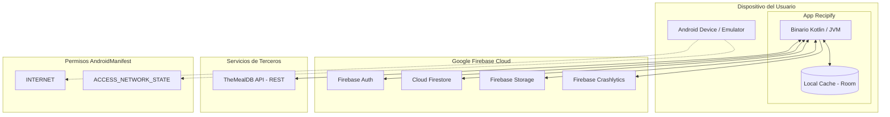

# D08. Diagrama de despliegue y servicios

**Objetivo:** Mostrar los servicios externos que integran el ecosistema de Recipify y cómo interactúan con el dispositivo móvil del usuario.

## Diagrama de Despliegue

## Explicación

- **Dispositivo del Usuario:** Representa el entorno de ejecución (Smartphone o Emulador) donde reside el binario de la aplicación y la base de datos local **Room** para persistencia offline de favoritos.
- **Ecosistema Firebase:**
    - **Firebase Auth:** Gestiona la identidad de los usuarios y la seguridad de las sesiones.
    - **Cloud Firestore:** Almacena de forma persistente y en tiempo real las recetas creadas por los usuarios.
    - **Firebase Storage:** Almacena los archivos binarios de las imágenes subidas por los usuarios.
    - **Firebase Crashlytics:** Servicio de observabilidad que recopila reportes de errores y métricas de estabilidad.
- **TheMealDB API:** Servicio externo consumido mediante peticiones HTTP (Retrofit) para obtener el catálogo internacional de recetas.
- **Permisos del Sistema:** La aplicación requiere `INTERNET` para comunicarse con todos los servicios en la nube y `ACCESS_NETWORK_STATE` para detectar cambios en la conectividad y gestionar el modo offline.
